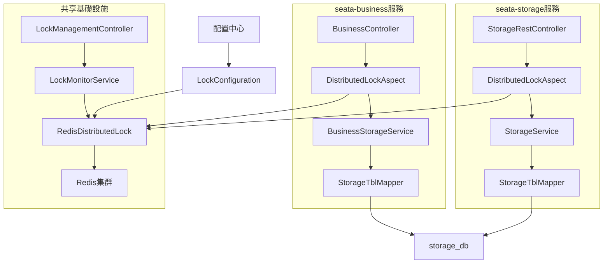
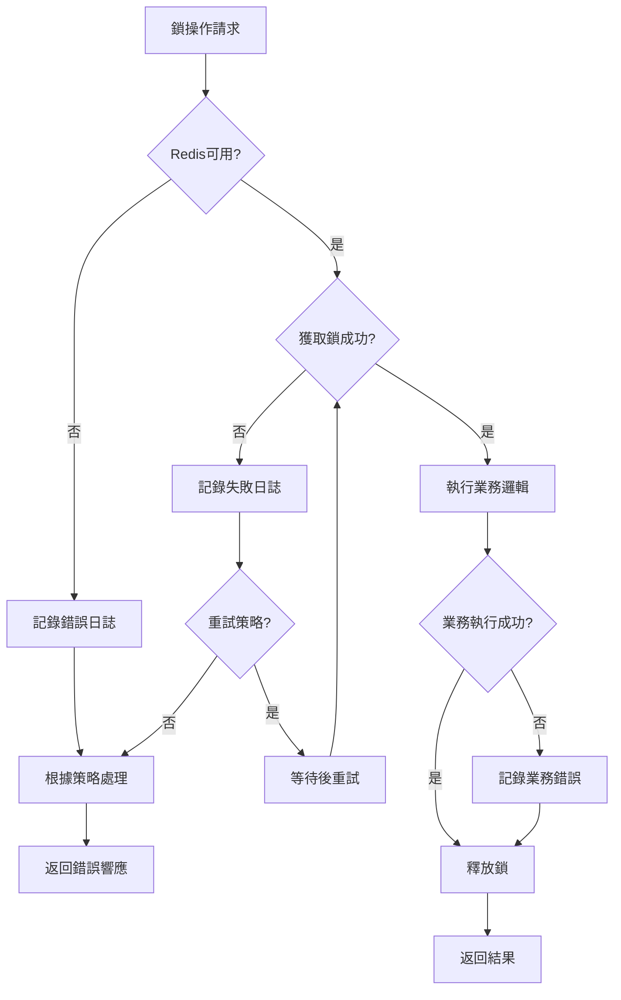
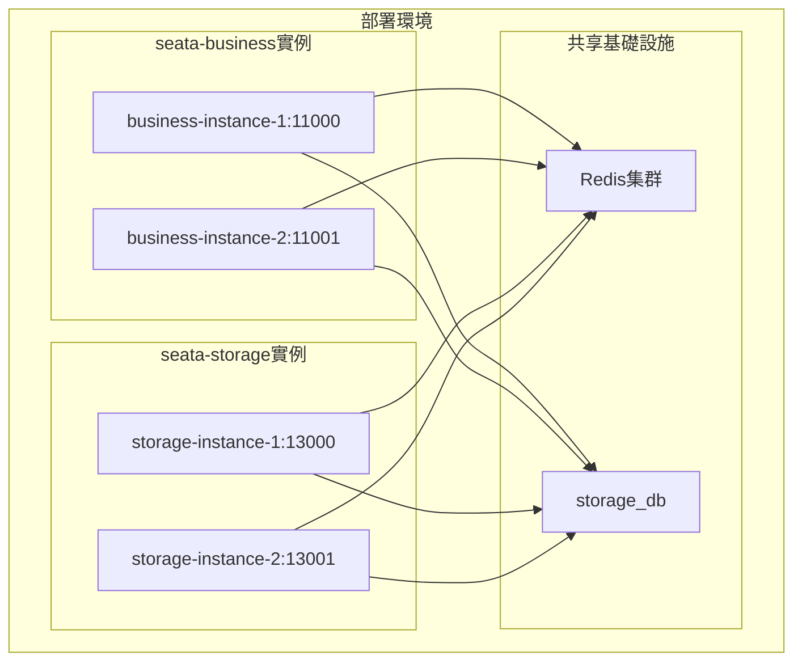

# 分布式鎖功能設計文檔

## 概述

本設計文檔描述了在seata-business和seata-storage兩個服務中實現分布式鎖功能的技術方案。由於兩個服務都需要直接操作storage_db數據庫的同一個表，因此需要使用分布式鎖來保證跨服務的數據一致性。

該功能將基於Redis實現，採用Redisson客戶端提供高性能和可靠的分布式鎖機制，與現有的Spring Boot + MyBatis + Seata架構無縫集成。

**核心場景：**
- seata-business服務：新增直接操作storage_db的API
- seata-storage服務：現有的deduct庫存扣減API
- 兩個服務的庫存操作都需要分布式鎖保護，防止併發衝突

## 架構

### 整體架構圖



### 技術架構層次

#### seata-business服務架構
1. **控制層 (Controller Layer)**
   - BusinessController：新增庫存操作API
   - LockManagementController：鎖管理接口

2. **服務層 (Service Layer)**
   - BusinessStorageService：直接操作storage_db的服務
   - LockMonitorService：監控服務

3. **數據訪問層 (Data Access Layer)**
   - StorageTblMapper：操作storage_db的Mapper

#### seata-storage服務架構
1. **控制層 (Controller Layer)**
   - 現有的StorageRestController

2. **服務層 (Service Layer)**
   - 現有的StorageService

3. **數據訪問層 (Data Access Layer)**
   - 現有的StorageTblMapper

#### 共享組件架構
1. **切面層 (Aspect Layer)**
   - DistributedLockAspect：基於註解的分布式鎖切面（兩個服務都使用）

2. **鎖實現層 (Lock Implementation Layer)**
   - RedisDistributedLock：核心分布式鎖實現
   - LockKeyGenerator：鎖鍵生成器

3. **基礎設施層 (Infrastructure Layer)**
   - Redis客戶端（Redisson）
   - 配置管理
   - 日誌記錄

## 組件和接口

### 跨服務數據庫配置

#### seata-business服務數據庫配置
由於seata-business需要直接操作storage_db，需要添加數據庫配置：

```yaml
spring:
  datasource:
    storage:
      url: jdbc:mysql://localhost:3306/storage_db?useUnicode=true&characterEncoding=utf-8&useSSL=false
      username: root
      password: 123456
      driver-class-name: com.mysql.cj.jdbc.Driver
```

#### 多數據源配置類
```java
@Configuration
public class DataSourceConfiguration {
    
    @Bean
    @ConfigurationProperties("spring.datasource.storage")
    public DataSource storageDataSource() {
        return DataSourceBuilder.create().build();
    }
    
    @Bean
    public SqlSessionFactory storageSqlSessionFactory(@Qualifier("storageDataSource") DataSource dataSource) throws Exception {
        SqlSessionFactoryBean bean = new SqlSessionFactoryBean();
        bean.setDataSource(dataSource);
        bean.setMapperLocations(new PathMatchingResourcePatternResolver().getResources("classpath:mapper/storage/*.xml"));
        return bean.getObject();
    }
    
    @Bean
    public SqlSessionTemplate storageSqlSessionTemplate(@Qualifier("storageSqlSessionFactory") SqlSessionFactory sqlSessionFactory) {
        return new SqlSessionTemplate(sqlSessionFactory);
    }
}

### 1. 核心分布式鎖接口

```java
public interface DistributedLock {
    /**
     * 嘗試獲取鎖
     * @param lockKey 鎖的鍵
     * @param waitTime 等待時間（秒）
     * @param leaseTime 鎖持有時間（秒）
     * @return 是否成功獲取鎖
     */
    boolean tryLock(String lockKey, long waitTime, long leaseTime);
    
    /**
     * 釋放鎖
     * @param lockKey 鎖的鍵
     */
    void unlock(String lockKey);
    
    /**
     * 檢查鎖是否存在
     * @param lockKey 鎖的鍵
     * @return 鎖是否存在
     */
    boolean isLocked(String lockKey);
}
```

### 2. 分布式鎖註解

```java
@Target(ElementType.METHOD)
@Retention(RetentionPolicy.RUNTIME)
public @interface DistributedLockable {
    /**
     * 鎖的鍵表達式，支持SpEL
     */
    String key();
    
    /**
     * 等待時間（秒），默認5秒
     */
    long waitTime() default 5;
    
    /**
     * 鎖持有時間（秒），默認30秒
     */
    long leaseTime() default 30;
    
    /**
     * 獲取鎖失敗時的處理策略
     */
    LockFailStrategy failStrategy() default LockFailStrategy.EXCEPTION;
}
```

### 3. 鎖監控服務接口

```java
public interface LockMonitorService {
    /**
     * 獲取當前所有鎖信息
     */
    List<LockInfo> getAllLocks();
    
    /**
     * 獲取指定鎖信息
     */
    LockInfo getLockInfo(String lockKey);
    
    /**
     * 強制釋放鎖
     */
    boolean forceUnlock(String lockKey);
    
    /**
     * 獲取鎖統計信息
     */
    LockStatistics getLockStatistics();
}
```

### 4. seata-business新增服務接口

```java
public interface BusinessStorageService {
    /**
     * 業務服務直接扣減庫存
     * @param commodityCode 商品編碼
     * @param count 數量
     * @param businessContext 業務上下文
     */
    void directDeduct(String commodityCode, int count, String businessContext);
    
    /**
     * 批量庫存操作
     * @param operations 批量操作列表
     */
    void batchStorageOperation(List<StorageOperation> operations);
}
```

### 5. 配置類

```java
@ConfigurationProperties(prefix = "distributed.lock")
public class DistributedLockProperties {
    private Redis redis = new Redis();
    private Lock lock = new Lock();
    
    public static class Redis {
        private String host = "localhost";
        private int port = 6379;
        private String password;
        private int database = 0;
        private int timeout = 3000;
    }
    
    public static class Lock {
        private long defaultWaitTime = 5;
        private long defaultLeaseTime = 30;
        private String keyPrefix = "distributed:lock:storage:";
        private boolean enableMonitoring = true;
        private boolean crossServiceLock = true; // 跨服務鎖標識
    }
}
```

## 數據模型

### 1. 鎖信息模型

```java
public class LockInfo {
    private String lockKey;           // 鎖鍵
    private String holder;            // 鎖持有者
    private long acquireTime;         // 獲取時間
    private long leaseTime;           // 租約時間
    private long remainingTime;       // 剩餘時間
    private String businessContext;   // 業務上下文
}
```

### 2. 鎖統計模型

```java
public class LockStatistics {
    private long totalLockRequests;     // 總鎖請求數
    private long successfulLocks;       // 成功獲取鎖數
    private long failedLocks;           // 失敗鎖請求數
    private long averageWaitTime;       // 平均等待時間
    private long averageHoldTime;       // 平均持有時間
    private Map<String, Long> lockKeyStats; // 各鎖鍵統計
}
```

### 3. 跨服務業務模型

```java
public class StorageOperation {
    private String commodityCode;
    private int count;
    private String operationType; // DEDUCT, ADD, SET
    private String serviceSource; // business, storage
    private String businessContext;
}

public class CrossServiceLockContext {
    private String lockKey;
    private String serviceSource;
    private String businessContext;
    private long timestamp;
}
```

### 4. Redis鎖數據結構

Redis中存儲的跨服務鎖信息：
```
Key: distributed:lock:storage:{commodityCode}
Value: {
    "holder": "seata-business-instance-1", // 或 "seata-storage-instance-1"
    "acquireTime": 1640995200000,
    "leaseTime": 30000,
    "businessContext": "business-direct-deduct", // 或 "storage-deduct"
    "serviceSource": "seata-business" // 或 "seata-storage"
}
TTL: 30秒（自動過期）
```

## 錯誤處理

### 1. 鎖獲取失敗處理策略

```java
public enum LockFailStrategy {
    EXCEPTION,    // 拋出異常
    RETURN_NULL,  // 返回null
    RETRY,        // 重試
    FALLBACK      // 降級處理
}
```

### 2. 異常類型定義

```java
public class DistributedLockException extends RuntimeException {
    private final LockErrorCode errorCode;
    
    public enum LockErrorCode {
        LOCK_ACQUIRE_TIMEOUT,     // 獲取鎖超時
        LOCK_RELEASE_FAILED,      // 釋放鎖失敗
        REDIS_CONNECTION_ERROR,   // Redis連接錯誤
        INVALID_LOCK_KEY,         // 無效鎖鍵
        LOCK_NOT_HELD            // 鎖未持有
    }
}
```

### 3. 錯誤處理流程



## 測試策略

### 1. 單元測試

- **RedisDistributedLock測試**
  - 鎖獲取和釋放功能
  - 超時機制測試
  - 異常情況處理

- **DistributedLockAspect測試**
  - 註解解析測試
  - SpEL表達式測試
  - 切面邏輯測試

- **LockMonitorService測試**
  - 監控數據收集
  - 統計信息計算
  - 管理操作測試

### 2. 集成測試

- **與Seata事務集成測試**
  - 事務提交時鎖釋放
  - 事務回滾時鎖釋放
  - 事務超時處理

- **併發測試**
  - 多線程併發獲取鎖
  - 高併發場景下的性能測試
  - 鎖競爭情況測試

### 3. 性能測試

- **吞吐量測試**
  - 1000併發請求下的響應時間
  - 鎖獲取成功率統計
  - 系統資源使用情況

- **壓力測試**
  - Redis連接池壓力測試
  - 長時間運行穩定性測試
  - 內存洩漏檢測

### 4. 端到端測試

- **庫存扣減場景測試**
  - 正常庫存扣減流程
  - 併發扣減防超賣測試
  - 異常情況恢復測試

## 實現細節

### 1. seata-business服務實現

#### 數據庫配置和Mapper配置
```java
@Configuration
@MapperScan(basePackages = "com.atguigu.business.mapper.storage", 
           sqlSessionTemplateRef = "storageSqlSessionTemplate")
public class StorageDataSourceConfiguration {
    
    @Bean
    @ConfigurationProperties("spring.datasource.storage")
    public DataSource storageDataSource() {
        return DataSourceBuilder.create().build();
    }
    
    @Bean
    public SqlSessionFactory storageSqlSessionFactory(@Qualifier("storageDataSource") DataSource dataSource) throws Exception {
        SqlSessionFactoryBean bean = new SqlSessionFactoryBean();
        bean.setDataSource(dataSource);
        bean.setMapperLocations(new PathMatchingResourcePatternResolver().getResources("classpath:mapper/storage/*.xml"));
        return bean.getObject();
    }
}
```

#### 業務服務實現
```java
@Service
public class BusinessStorageServiceImpl implements BusinessStorageService {
    
    @Autowired
    private StorageTblMapper storageTblMapper;
    
    @Override
    @DistributedLockable(key = "'storage:' + #commodityCode", waitTime = 5, leaseTime = 30)
    @Transactional(rollbackFor = Exception.class)
    public void directDeduct(String commodityCode, int count, String businessContext) {
        // 直接操作storage_db
        storageTblMapper.deduct(commodityCode, count);
        
        // 業務邏輯處理
        if (count > 10) {
            throw new RuntimeException("單次扣減數量過大！");
        }
    }
}
```

### 2. Redisson集成配置（兩個服務都需要）

```java
@Configuration
@EnableConfigurationProperties(DistributedLockProperties.class)
public class RedissonConfiguration {
    
    @Bean
    public RedissonClient redissonClient(DistributedLockProperties properties) {
        Config config = new Config();
        config.useSingleServer()
              .setAddress("redis://" + properties.getRedis().getHost() + ":" + properties.getRedis().getPort())
              .setPassword(properties.getRedis().getPassword())
              .setDatabase(properties.getRedis().getDatabase())
              .setTimeout(properties.getRedis().getTimeout());
        
        return Redisson.create(config);
    }
}
```

### 3. 跨服務鎖鍵生成策略

```java
@Component
public class CrossServiceLockKeyGenerator {
    private static final String KEY_PREFIX = "distributed:lock:storage:";
    
    public String generateStorageLockKey(String commodityCode) {
        // 兩個服務使用相同的鎖鍵格式，確保互斥
        return KEY_PREFIX + commodityCode;
    }
    
    public String generateBatchLockKey(List<String> commodityCodes) {
        // 批量操作時的鎖鍵
        String sortedCodes = commodityCodes.stream().sorted().collect(Collectors.joining(","));
        return KEY_PREFIX + "batch:" + DigestUtils.md5Hex(sortedCodes);
    }
}

### 4. 與Seata事務的集成點

#### seata-business服務的事務集成
- **GlobalTransactional開始前**：獲取分布式鎖
- **全局事務提交後**：釋放分布式鎖
- **全局事務回滾後**：立即釋放分布式鎖
- **事務超時時**：配合鎖超時機制

#### seata-storage服務的事務集成
- **本地事務開始前**：獲取分布式鎖
- **本地事務提交後**：釋放分布式鎖
- **本地事務回滾後**：立即釋放分布式鎖

#### 跨服務鎖衝突處理
```java
@Component
public class CrossServiceLockConflictHandler {
    
    public void handleLockConflict(String lockKey, String currentService, String holderService) {
        // 記錄跨服務鎖衝突
        log.warn("Cross-service lock conflict detected. Key: {}, Current: {}, Holder: {}", 
                lockKey, currentService, holderService);
        
        // 可以實現優先級策略或等待策略
    }
}

### 5. 跨服務監控指標收集

```java
@Component
public class CrossServiceLockMetricsCollector {
    private final MeterRegistry meterRegistry;
    
    public void recordLockAcquire(String lockKey, String serviceSource, boolean success, long duration) {
        Timer.Sample sample = Timer.start(meterRegistry);
        sample.stop(Timer.builder("distributed.lock.acquire")
                   .tag("key", lockKey)
                   .tag("service", serviceSource)
                   .tag("success", String.valueOf(success))
                   .register(meterRegistry));
    }
    
    public void recordCrossServiceConflict(String lockKey, String requestingService, String holdingService) {
        Counter.builder("distributed.lock.cross.service.conflict")
               .tag("key", lockKey)
               .tag("requesting", requestingService)
               .tag("holding", holdingService)
               .register(meterRegistry)
               .increment();
    }
}

## 部署考慮

### 1. 跨服務部署架構



### 2. Redis部署建議

- **生產環境**：使用Redis集群模式，確保高可用
- **開發環境**：單機Redis即可
- **鎖鍵命名空間**：使用統一的鍵前綴避免衝突
- **配置建議**：適當的內存配置和持久化策略

### 3. 數據庫連接配置

#### seata-business服務配置
```yaml
spring:
  datasource:
    storage:
      url: jdbc:mysql://localhost:3306/storage_db
      username: root
      password: 123456
      hikari:
        maximum-pool-size: 10
        minimum-idle: 5
```

#### seata-storage服務配置（保持現有）
```yaml
spring:
  datasource:
    url: jdbc:mysql://localhost:3306/storage_db
    username: root
    password: 123456
```

### 4. 配置管理

- 支持Nacos配置中心動態配置
- 環境變量覆蓋支持
- 跨服務配置一致性保證
- 配置熱更新機制

### 5. 監控和告警

- 集成Spring Boot Actuator健康檢查
- 跨服務鎖衝突監控
- 鎖獲取失敗率告警
- Redis連接異常告警
- 鎖持有時間過長告警
- 數據庫連接池監控

### 6. 服務發現和負載均衡

- 兩個服務都註冊到Nacos
- 使用相同的Redis實例確保鎖的一致性
- 負載均衡不影響分布式鎖的正確性

這個跨服務設計確保了：
- **數據一致性**：兩個服務操作同一數據庫時的互斥保護
- **高可用性**：支持多實例部署和故障轉移
- **監控完整性**：跨服務的鎖使用情況監控
- **配置統一性**：兩個服務使用一致的鎖配置
- **擴展性**：支持更多服務加入相同的鎖機制